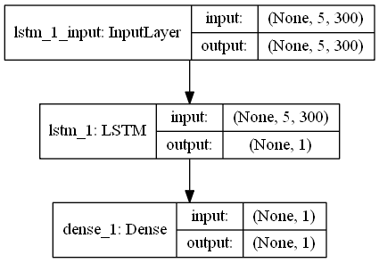

## Results

| Model | Accuracy | Macro Precision | Macro Recall |
| --- | --- | --- | --- |
| Baseline | 0.51042 | 0.25521 | 0.5 |
| Naive vector similarity | 0.58311 | 0.58301 | 0.58304 |
| Basic LSTM on sentence vectors | 0.50508 | 0.51137 | 0.50508 |
| Flair Naive Sentiment vector <not going to turn in>| 0.49653| 0.49644| 0.49644
| NLTK NAIVE SENTIMENT|  0.46392 | 0.46456 | 0.46606
| NTLK LOG REGRESSION (SENTIMENT ONLY) | 0.44896 | 0.44897 | 0.44895
| NTLK NN Classifier | 0.60609 |0.61236 | 0.60315
| SKLearn NN on sentiment | 0.60075 | 0.60074 | 0.60079 |
| NN on spacy vector representation | 0.54730 | 0.57570 | 0.54730 | 

#### Baseline

Our baseline for performance comparison is a simple majority vote.

#### Naive vector similarity

For this first approach, the four context sentences, first and second conclusions are vectorized using spaCy embeddings, specifically from the `en_core_web_md` model.  The conclusion with the closest (largest) cosine similarity to the context is the predicted answer. 


#### Basic LSTM on sentence vectors

For this approach, we take the vectors for the four context sentences (separately), with a vector for the closure, and feed these through an LSTM and learn a binary classification output for whether this is the correct closure.

We first preprocess all data, turning it into 5 sentences (the 4 context sentences with one of the closures), and set the expected label to be 1 if this closure is correct, or 0 if the other is correct.  We do this for both closure outputs, effectively yielding double the training data points.

The model is a very basic one - 5 timeslice points into a keras LSTM layer with a single output.  This output is put through a sigmoid function (Dense layer with 1 output).




#### NN on spacy vector representation

We trained a keras multi-layer NN comprised of Dense layers on the SpaCy vector representation of the  

 ---
 
# Running the models

For the 2731 Final Project, the official final model is the SKLearn NN on the sentiment representation of the input.  We are also including a secondary submission of the naive vector similarity model.

### Setting up the environment

There is a pip requirements file with all required library versions, saved via `pip freeze`.  You may set up a venv with python 3.6, and install these libraries with `pip install -r requirements.txt` from the project root directory.

There are also models which must be downloaded via the proper interfaces (Spacy).  Do this with, in terminal within the venv, `python -m spacy download en_core_web_md`.

### Models

##### SKLearn NN on Sentiment model

This is modeled in the `sentiment_NN` directory under `sentiment_NN.py`.  This requires the sentiment form of the input data, which is included in the final submission (it takes a long time to convert).  Alternatively, you can do the conversion yourself with the `sentiment_converter` script.

There is a learned model, `basic_model`, which can be loaded (does so by default) and used to do inference.  In that folder we also include the prediction of the held-out test set, `test_prediction.txt`.  This may be directly compared to the true gold standard of the test set with the evaluation script given in `eval` (same as supplied in the project description, with added precision and recall metrics.)

```
cd sentiment_NN
python sentiment_NN.py
```

This will save the output of the test data to `prediction.txt` in the same folder as the script.

##### Naive vector similarity

This is modeled in the `naive_vector_similarity` directory under `naive_vector_similarity.py`.  This is a simple rule which takes the closure sentence which is closest to the input sentences, via dense vector representation given by the medium SpaCy english web model (`en_core_web_md`).

The test set has been inferred and is included with submission. You may directly compare this with the gold standard with the given evaluation script.

```
cd naive_vector_similarity
python naive_vector_similarity.py
```

This will save the output of the test data to `test_prediction.txt` in the same folder as the script.

#### Evaluation

The test predictions are stored in the respective folders of the models.  The supplied evaluation script is under the `eval` directory.  Run the evaluation script with the gold/predicted files as follows (run from the eval directory)
The evalScript was modified slightly to also give the macro precision and recall statistics.

```
cd eval

python evalScript.py ../sentiment_NN/test_prediction.txt ../path/to/test/gold/gold.txt

python evalScript.py ../naive_vector_similarity/test_prediction.txt ../path/to/test/gold/gold.txt
```
 
 ---
 
### Data

The supporting data for this project must be requested manually:

https://www.cs.rochester.edu/nlp/rocstories/

The data for this project (supplied by Univ. of Rochester CS) will not be shared outside of the above source.

Data should be stored in the `Data` directory, which is ignored in git.  You must download the dataset and create that folder yourself locally.